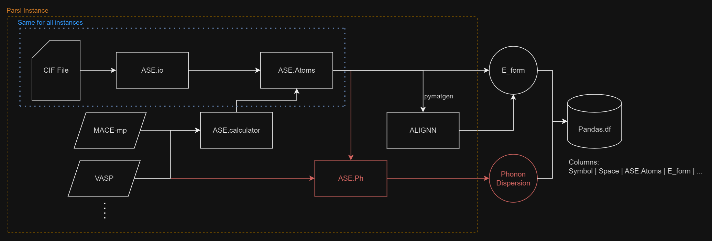

# ML Mat

## Code Design

In order to parallelize the various aspects of the process, we expect the three items outlined in blue to be performed/supplied to all parsl instances. Thus, every *different kind of process* can be implemented in its own function that gets passed to it an `ase.Atoms` object obtained from a `CIF` file. The `execute_runner` function handles this functionality. You pass to it a `parsl` configuration, a `runner` function (implemented as a `@python_app`), a `reduce` function that takes a list of the returns of `runner`, a list of file name strings, and finally any other arguments you want to pass to the `runner` function.

Each runner is executed for each file in parallel and their returns are agreggated into a final object using the `reduce` function.

## CI Example
So, here is an example of running simple `unittests`, some of which have to do with Parsl directly (the `config.py` and `mcarlo.py` files). The virtual environment is in my current home directory, but a shared folder is better.

### Note
Currently, the shell script just assumes that the correct environment is inside the `~/` directory. However, we should obtain a [shared directory](https://darwin.lanl.gov/doku.php?id=faq:sharedproject) that all of the CI runners can grab their environment from. Also, we should [have different environments for each node type](https://darwin.lanl.gov/doku.php?id=tutorial:pythonexample&s[]=python#:~:text=Darwin%20is%20a,were%20built%20for.) if we want to execute across different archs. 